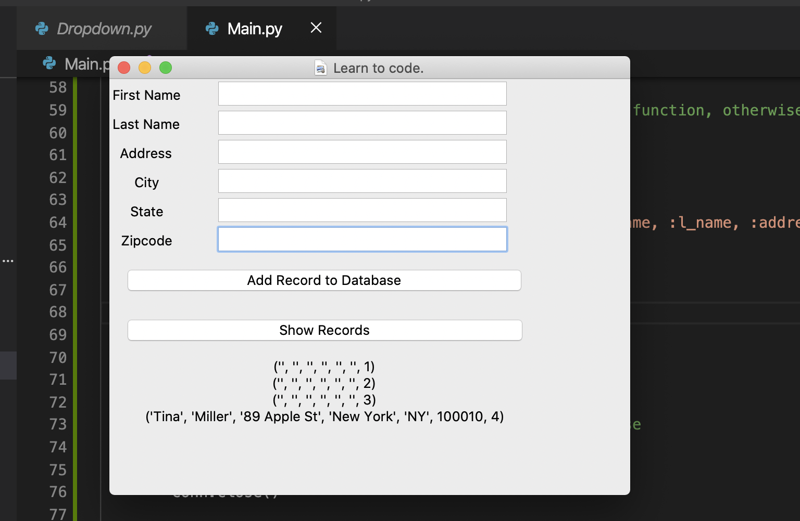
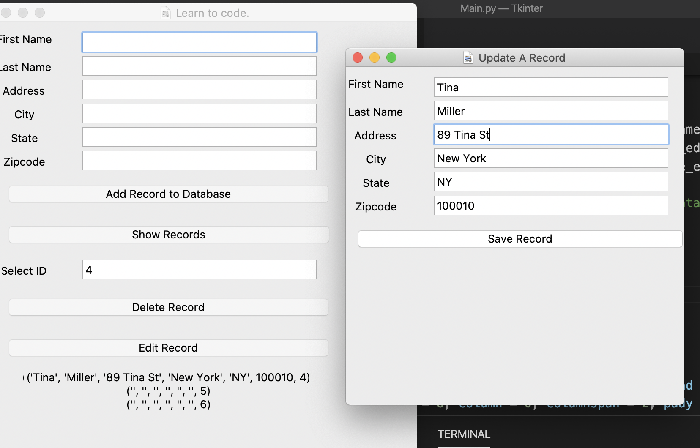
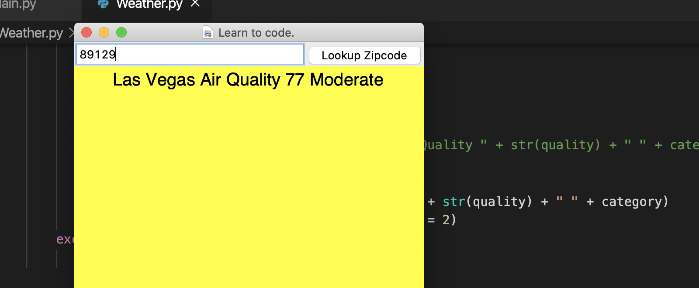

# Building a Weather APP using Tkinter
**SQLite3 database**: A simple tkinter interface to accept user's information, write them into database and retrieve the information as well. 

Create a new window to update the sqlite database 

Connect to an API for Weather data. 

A simple calculator. 
